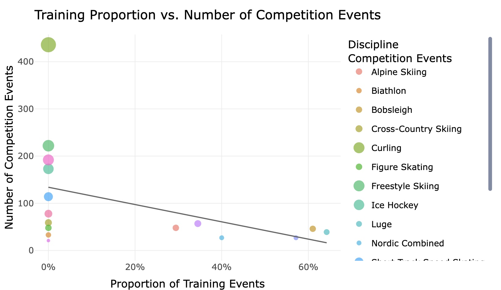

# sta221sp-TidyTuesdayBenny
TidyTuesday work for Statistics Experience credit in Sta221

## Final Visualization

 

This project uses the 2026 Milan-Cortina Winter Olympics dataset from TidyTuesday (Feb. 10, 2026), which contains a full schedule of 1,866 Olympic sessions including competition events, training sessions, and other schedule items across all Winter Olympic disciplines. My initial interest was in the existence of training events within the `event_description` variable. By creating a new boolean variable called `training` through a mutation pipeline, I visualized the relationship between the proportion of events for a discipline that were `training` with the number of competition events for a given discipline. My logic here was that, if a sport has fewer actual competition events, athletes may need more (if any) training sessions to prepare and get familiar with the track. Furthermore, fewer actual competition events means each actual competition carries more weight and has less margin for error, furthering the need for preparation and familiarity. The resulting interactive scatterplot (built with plotly) plots each discipline as a point, sized by the number of competition events (i.e. a larger circle indicates more competition events), with a line of best fit overlaid. While the trend weakly supports the hypothesis, an R² of 0.18 tells us that training proportion explains only about 18% of the variation in competition events. Note that the screenshot above is a static version of the graph; the full interactive version - where you can hover over points for discipline details and isolate individual disciplines - is available in the rendered HTML from the .qmd file.